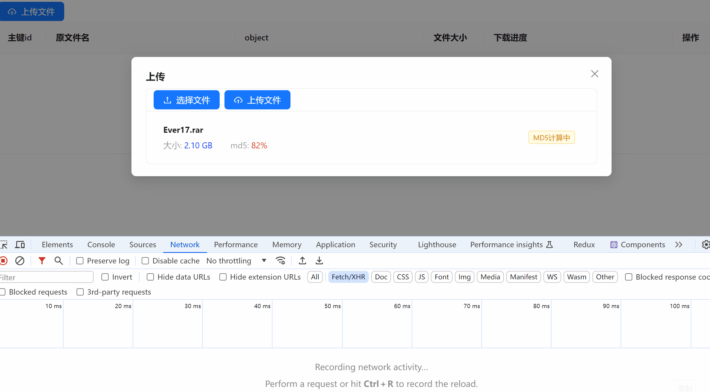
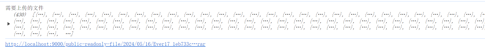
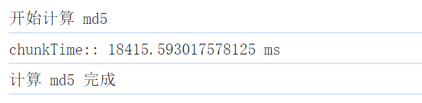

# 项目技术

> 分片上传的方式有很多，这里只是列举了一种，无法满足所有场景，仅供学习参考。若需要了解上传时的流程设计，可查看 [上传设计思路](#大文件分片上传流程设计)，以便快速定位该项目示例是否符合您的需求。

- 前端React：React + TypeScript + antd + axios
- 前端Vue：vue@3.4 + TypeScript + arco design vue + axios
- 后端：SpringBoot3.x + Redis + minio + lombok + MybatisPlus

以上框架和技术均为截至 24年5月 的最新的版本，旧版本需自行查看相关变动

> - 两个前端项目的逻辑代码基本一致，为适配两个框架不同组件库的组件，可能会有极细微的差异，可忽略不计
> - vue 项目使用 vue3 setup 语法糖 与 vue2 差异较大，暂未提供 vue2 版本，语法差异自行处理。

# 预览图

## 上传文件功能预览

展示及请求

前端控制台

浏览器可支持的文件预览

目录结构

## 下载文件功能预览

下载及暂停操作展示

下载内容展示

一个大文件的上传，对接后端的请求有三个

- 点击上传时，请求 **<检查文件 md5>** 接口，判断文件的状态（已存在、未存在、传输部分）
- 根据不同的状态，通过 **<初始化分片上传地址>**，得到该文件的分片地址
- 前端将分片地址和分片文件一一对应进行上传，这步直接对接 minio
- 上传完毕，调用 **<合并文件>** 接口，合并文件，文件数据入库

> 上传时通过 `p-limit` 限制了上传的并发请求。
> 下载由于有暂停操作，需要循环过程中中止，一旦使用 `p-limit`，暂时没有想到两者结合的完美暂停方案，因此并未对下载做并发限制，欢迎 PR。

# 大文件分片上传流程设计

以上流程图的文字版：

1. 前端计算文件 md5，并请求查询此文件的状态
2. 若文件已上传，则后端直接返回上传成功，并返回 url 地址
3. 若文件未上传，则前端请求初始化分片接口，返回上传地址。循环将分片文件和分片地址一一对一应
4. 若文件上传一部分，后端会返回该文件的 uploadId （minio中的文件标识）和 listParts（已上传的分片索引），前端请求初始化分片接口，后端重新生成上传地址。前端循环将已上传的分片过滤掉，未上传的分片和分片地址一一对应。
5. 前端通过分片地址将分片文件一一上传
6. 上传完毕后，前端调用合并分片接口
7. 后端判断该文件是单片还是分片，单片则不走合并，仅信息入库，分片则先合并，再信息入库。删除 redis 中的文件信息，返回文件地址。

# 注意事项

## Woker 线程注意事项

- 前端采用多线程计算分片 md5，然后使用 **MerkleTree** 计算文件的 hash。相较于单线程计算 md5，会节省 70% ~ 80% 的时间 

优化前，一个 2.1G 的文件上传耗时 18s

优化后仅 2 s

### 缺陷

- 由于 MerkleTree 是采用每个分片的叶子节点进行计算，而分片大小会影响分片的 md5，进而影响整个文件的树根节点 hash，所以**不能随意变动分片大小，否则 MerkleTree 计算出来的 md5 将会改变，后台将会重新识别为一个新文件进行上传**

## minio 注意事项

- minio 开启了公共只读策略，所以不需要进行签名访问
- 如何开启 minio 公共只读策略？**见 service 文件夹（后端）的测试类 `ReactMinioSpringApplicationTests`**

# 文件磁盘缓存问题

目前刷新网页是不会留存已下载文件的分片数据的，因为所有数据都在网页内存中。若要实现边下载边缓存，即使关闭浏览器也能缓存结果的功能，有以下几种思路实现。

- **IndexDB 存储**：可以长期留存在浏览器内存中，实现刷新甚至关闭网页，已下载文件不会丢失的情况。
  - 缺点：IndexDB 的存入速度较慢，在分片下载情况下，同步存储 IndexDB，会导致下载时长高出一倍以上，且文件的存储大小可能会影响浏览器的运行。
  - 已试验，效果并不理想，因此未集成至代码中
- **FileSystem API 存储**：可以让浏览器直接调用文件夹的权限实现读写。
  - 缺点：交互性并不好，且 API 兼容性很差。一次性写入可实现，分片写入和读取的能力暂未尝试，但是有可探索空间。
  - 仅尝试简单一次性写入，分片写入未试验
- **Electron 客户端**：可直接操作 node 实现文件的读写存储，理想情况下是最佳方式。
  - 未试验