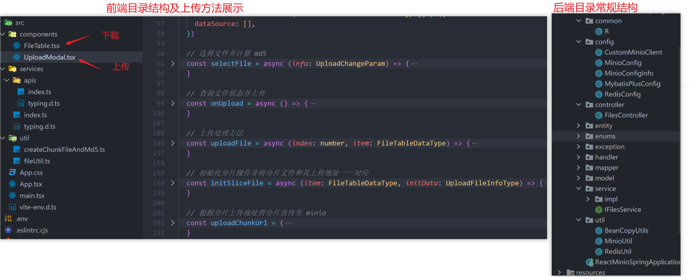
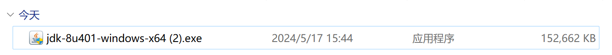
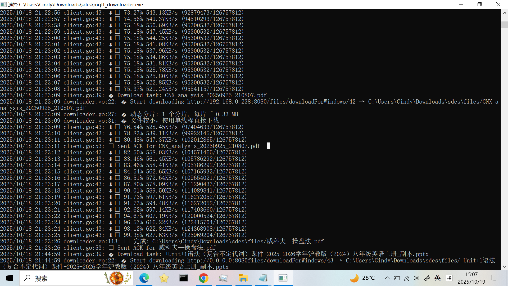

# 项目说明

> 研究基于minio服务文件的二级缓存分发，支持HTTP和SFTP，仅供学习参考。
> web客户端支持http上传下载文件.
> go下载客户端，当文件上传成功后，服务端通过MQTT消息通知windows客户端下载文件。
> 服务端增加go客户端分片下载的API，增加文件二级缓存下载策略。

# 适用场景
- AI 训练数据文件同步（大文件分片传输）
- 分布式文件分发系统（内部文档分发、门店同步、电力行业e文件分发）
- OTA 升级系统（固件分片下载）

# 项目技术

- windows客户端：go + MQTT
- 前端Vue：vue@3.4 + TypeScript + arco design vue + axios
- 后端：SpringBoot3.x + Redis + minio + lombok + MybatisPlus


# 项目架构
```
+--------------------------------+
|  1-2000 windows Clients         | 
|  (MQTT Downloader Go)          |
+-----------+--------------------+
            ↑
            |
            |
+------------------------+          +------------------------+
|   Download Proxy API   | ← ------ |    前端页面上传文件      |
|  (Spring Boot + Redis) |          |      (vue web )        |
|                        |          +------------------------+
| - 分片请求调度           |
| - Redis文件元信息缓存     |
| - 分片结果缓存           |
| - 断点续传Range支持      |
| - Caffeine + Redis 双层缓存 |
+-----------+------------+
            |
            ▼
+------------------------+
|        MinIO           |
| (对象存储, S3 API兼容)   |
+------------------------+
```

# 架构核心说明


## 双层二级缓存体系

| 层级                     | 类型       | 存储内容                          | 特点              |
| ----------------------- | ----------- | ----------------------------- | --------------- |
| 一级缓存（本地内存，Caffeine）| 高速内存   | 常用分片（byte[]）、文件元信息、对象元数据 | 纳秒级访问速度、轻量、线程安全 |
| 二级缓存（Redis）      | 分布式缓存       | 跨节点共享的缓存副本（文件元信息、对象Stat、热点区块） | 适合多节点集群共享，提高命中率 |
| 第三层（持久层）           | MinIO / 数据库 | 永久文件 + 元数据                    | 源数据持久化存储层       |


工作流程：

请求文件分片 → 
  1. Caffeine命中 → 直接返回
  2. Redis命中 → 回填到Caffeine → 返回
  3. MinIO取文件 → 更新Redis + Caffeine

## 分片（Range）流式下载机制

  服务端 Controller 支持 Range: bytes=xxx-yyy

  DownloadManager 自动从 MinIO 读取对应区块 → 写入本地磁盘 + 内存缓存

  客户端并发请求多个分片并行下载

  支持断点续传（从部分已完成分片继续下载）

## 多级并发 + in-flight 去重

  同一分片的多个并发请求只下载一次（用Caffeine实现）

  线程池 downloadPool 管理 I/O 密集任务，防止过载

  失败自动重试 + 临时文件写入 + 原子 rename


# 架构优势:高性能

| 功能点           | 优势                   |
| ------------- | -------------------- |
| Caffeine 内存缓存 | 缓存热点文件分片，减少 I/O      |
| Redis 二级缓存    | 缩短集群访问延迟，减少 MinIO 压力 |
| Range 分片下载    | 并发分片提高吞吐量，支持断点续传     |
| 异步下载 + 去重     | 避免重复请求相同文件分片         |

# 架构优势:高可用性与稳定性
| 特性           | 说明                                               |
| ------------ | ------------------------------------------------ |
| 多级缓存容错       | 若 Caffeine 清理 → Redis 回补；若 Redis 过期 → 自动回源 MinIO |
| 临时文件机制       | 断点续传、重启后不丢进度                                     |
| 异常自动重试       | 分片下载失败自动重试 3 次，防止网络抖动                            |
| in-flight 去重 | 避免热点文件被重复下载，降低服务端负载                              |


# 预览图

## 上传文件功能预览

展示及请求


前端控制台


浏览器可支持的文件预览


目录结构


## 下载文件功能预览

下载及暂停操作展示


下载内容展示



一个大文件的上传，对接后端的请求有三个

- 点击上传时，请求 **<检查文件 md5>** 接口，判断文件的状态（已存在、未存在、传输部分）
- 根据不同的状态，通过 **<初始化分片上传地址>**，得到该文件的分片地址
- 前端将分片地址和分片文件一一对应进行上传，这步直接对接 minio
- 上传完毕，调用 **<合并文件>** 接口，合并文件，文件数据入库

> 上传时通过 `p-limit` 限制了上传的并发请求。
> 下载由于有暂停操作，需要循环过程中中止，一旦使用 `p-limit`，暂时没有想到两者结合的完美暂停方案，因此并未对下载做并发限制，欢迎 PR。

# windows client下载文件预览


# 大文件分片上传流程设计


以上流程图的文字版：

1. 前端计算文件 md5，并请求查询此文件的状态
2. 若文件已上传，则后端直接返回上传成功，并返回 url 地址
3. 若文件未上传，则前端请求初始化分片接口，返回上传地址。循环将分片文件和分片地址一一对一应
4. 若文件上传一部分，后端会返回该文件的 uploadId （minio中的文件标识）和 listParts（已上传的分片索引），前端请求初始化分片接口，后端重新生成上传地址。前端循环将已上传的分片过滤掉，未上传的分片和分片地址一一对应。
5. 前端通过分片地址将分片文件一一上传
6. 上传完毕后，前端调用合并分片接口
7. 后端判断该文件是单片还是分片，单片则不走合并，仅信息入库，分片则先合并，再信息入库。删除 redis 中的文件信息，返回文件地址。

# 注意事项

## Woker 线程注意事项

- 前端采用多线程计算分片 md5，然后使用 **MerkleTree** 计算文件的 hash。相较于单线程计算 md5，会节省 70% ~ 80% 的时间 

优化前，一个 2.1G 的文件上传耗时 18s


优化后仅 2 s


### 缺陷

- 由于 MerkleTree 是采用每个分片的叶子节点进行计算，而分片大小会影响分片的 md5，进而影响整个文件的树根节点 hash，所以**不能随意变动分片大小，否则 MerkleTree 计算出来的 md5 将会改变，后台将会重新识别为一个新文件进行上传**

## minio 注意事项

- minio 开启了公共只读策略，所以不需要进行签名访问
- 如何开启 minio 公共只读策略？**见 service 文件夹（后端）的测试类 `ReactMinioSpringApplicationTests`**


# 文件磁盘缓存问题

目前刷新网页是不会留存已下载文件的分片数据的，因为所有数据都在网页内存中。若要实现边下载边缓存，即使关闭浏览器也能缓存结果的功能，有以下几种思路实现。

- **IndexDB 存储**：可以长期留存在浏览器内存中，实现刷新甚至关闭网页，已下载文件不会丢失的情况。
  - 缺点：IndexDB 的存入速度较慢，在分片下载情况下，同步存储 IndexDB，会导致下载时长高出一倍以上，且文件的存储大小可能会影响浏览器的运行。
  - 已试验，效果并不理想，因此未集成至代码中
- **FileSystem API 存储**：可以让浏览器直接调用文件夹的权限实现读写。
  - 缺点：交互性并不好，且 API 兼容性很差。一次性写入可实现，分片写入和读取的能力暂未尝试，但是有可探索空间。
  - 仅尝试简单一次性写入，分片写入未试验
- **Electron 客户端**：可直接操作 node 实现文件的读写存储，理想情况下是最佳方式。
  - 未试验